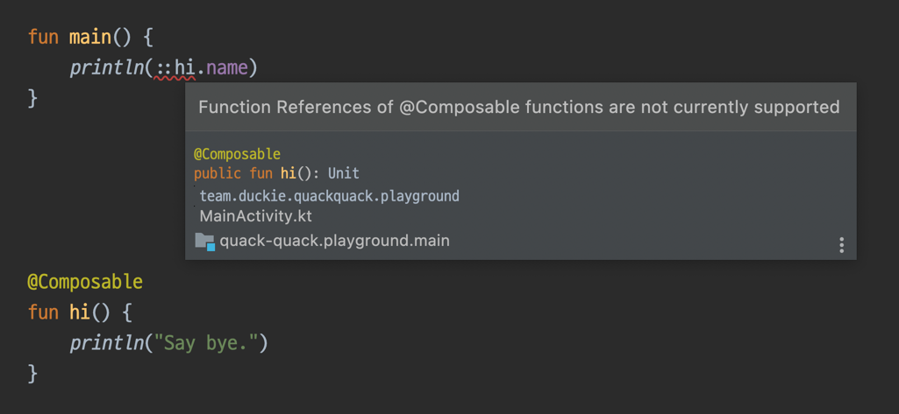

## composer-function-reference-diagnostic-suppressor

`COMPOSABLE_FUNCTION_REFERENCE` diagnostic suppression Kotlin compiler plugin

### Why?

We can use `.name` on reflection via double-clone(`::`) the function to get the name of the function.

```kotlin
fun main() {
    println(::hi.name) // hi
}

fun hi() {
    println("Say bye.")
}
```

This can be useful to avoid hardcoding function names.
However, in the case of a Composable function, reference access is blocked.



Because of this limitation, hardcoding is required to get the name of the Composable function.
This Kotlin compiler plugin was developed to avoid this limitation.

### Download 

|                                     version                                     |                                   kotlin compatibility                                   |
|:-------------------------------------------------------------------------------:|:----------------------------------------------------------------------------------------:|
|  |  |

```kotlin
repositories {
    maven {
        // we need a dev repository to keep the Compose Compiler always up-to-date.
        url = uri("https://maven.pkg.jetbrains.space/public/p/compose/dev")
    }
}

dependencies {
    add(
        org.jetbrains.kotlin.gradle.plugin.PLUGIN_CLASSPATH_CONFIGURATION_NAME,
        "land.sungbin:composable.reference.suppressor.plugin:${version}"
    )
}
```

### Caveat

Currently, no IDE support. [[similar issue]](https://github.com/ZacSweers/redacted-compiler-plugin/issues/8)

So if you try to reference a Composable function, you still get an error in the IDE.
**But when you actually run the build, it succeeds.**

### Copyright

This project is licensed under the MIT License.
Please refer to the [LICENSE file](LICENSE) for details.
